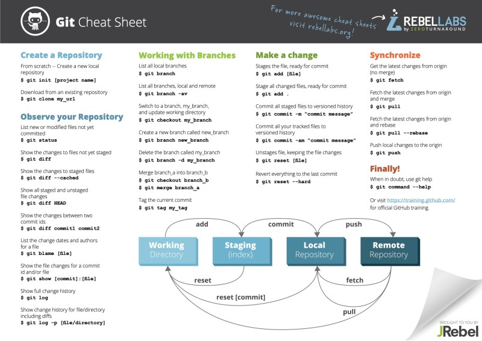

# TIL

## 리눅스 명령어
1. ls
   >list (목록표시)

2. cd
   >change directory (작업 경로 변경)

3. rm
   >remove (파일 삭제)

4. mkdir   
   >make directory (작업목록 생성)   

5. rmdir
   >remove directory (작업목록 삭제)

6. touch
   >파일생성

7. cat
   >파일의 내용 출력

## Git
1. init
    >git 생성

2. add<파일명>
    >staging area로 이동

3. commit -m <메세지>
   >Repository로 이동

4. push <원격저장소><브랜치>
   >원격(Github)으로 이동

5. pull <원격저장소><브랜치>
   >원격에서 로컬로 복사

6. clone <원격저장소><브랜치>
   >원격에서 로컬로 복제

7. status
   >staging area의 상태 (git의 상태)

8. log
   >repository의 상태

9. git commit --amend
    >바로 전commit과 staging area의 merge를 할때

10. git restore --staged <파일명>
    >staging area에 있는 파일을 working directory로 가져옴

